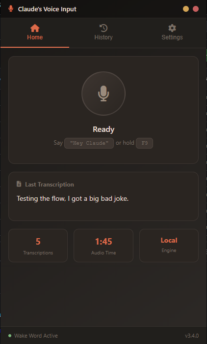
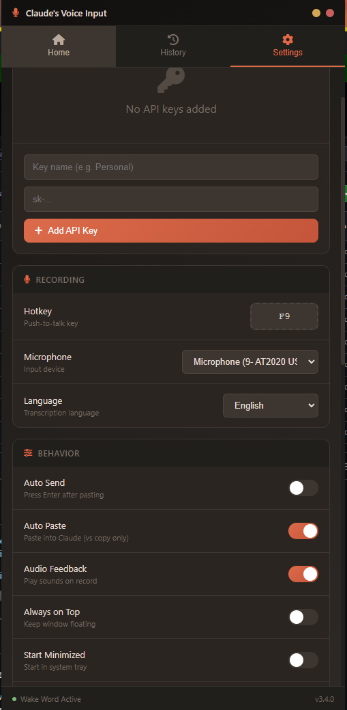
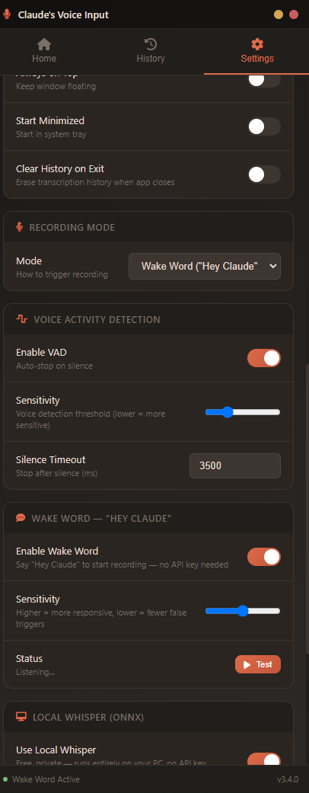
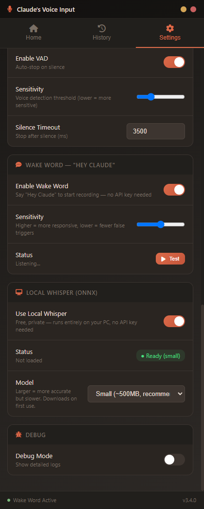

# Claude's Voice Input

**Talk to Claude Desktop instead of typing.** A lightweight Electron app that captures your voice, transcribes it with Whisper, and pastes the text directly into Claude Desktop — hands-free.

Works **100% offline** with built-in local Whisper, or use the OpenAI Whisper API for cloud-powered transcription.


---

## Screenshots

<p align="center">
  
  
</p>
<p align="center">
  
  
</p>

---

## Features

### Voice-to-Text for Claude
- Speak naturally and your words appear in Claude Desktop
- Auto-paste directly into Claude's input field
- Optional auto-send (press Enter after pasting)
- "Use Again" button to re-paste any previous transcription

### Three Recording Modes
- **Push-to-Talk** — Hold your hotkey (default: F9) to record, release to stop. VAD won't cut you off — you control when recording ends.
- **Tap-to-Talk** — Press hotkey once to start, VAD auto-stops when you go silent (or tap again)
- **"Hey Claude" Wake Word** — Just say "Hey Claude" and start talking, completely hands-free. VAD auto-stops after silence.

### Local Whisper (No API Key Needed)
- Built-in ONNX-powered Whisper runs entirely on your machine
- No Python, no API key, no internet required for transcription
- Models: tiny (~75 MB), base (~150 MB), **small (~500 MB, recommended)**, medium (~1.5 GB), large-v3 (~3 GB)
- Auto-downloads on first use with progress indicator

### Cloud Whisper API (Alternative)
- Uses OpenAI's Whisper API for fast, accurate transcription
- Costs ~$0.006/minute of audio
- Manage multiple API keys with named profiles

### Smart Voice Activity Detection (VAD)
- Speech-band frequency filtering (300–3000 Hz)
- Adaptive noise floor calibration — works in any environment
- Auto-stops recording after silence in tap-to-talk and wake word modes (configurable, default 3.5s)
- **Disabled during push-to-talk** — holding the key gives you full control, pauses won't cut you off
- Adjustable sensitivity slider

### "Hey Claude" Wake Word
- Local ONNX model — works offline, no training needed
- Continuously listens in the background using minimal resources
- Adjustable detection sensitivity
- Say "Hey Claude" to start recording, then speak your message

### Privacy & Offline Support
- All local processing stays on your machine
- No telemetry, no analytics, no data collection
- Bundled Font Awesome icons (no CDN calls)
- "Clear History on Exit" option erases transcription history on close
- Transcription history stored locally only

### Quality of Life
- First-launch onboarding wizard guides you through setup
- System tray icon with quick controls
- Transcription history with copy/re-paste
- Usage stats (transcription count, audio seconds, estimated cost)
- Custom Whisper vocabulary hints for proper nouns
- Multi-language support via Whisper language codes
- Always-on-top option
- Start minimized to tray
- Audio feedback (record start/stop sounds)
- Configurable hotkey

---

## Quick Start

### Option A: Download the Portable EXE (Easiest)
1. Go to [Releases](https://github.com/420247jake/claudes-voice-input/releases)
2. Download `ClaudesVoiceInput-v3.4.1.exe`
3. Run it — no installation needed
4. The onboarding wizard walks you through setup

### Option B: Run from Source
```bash
git clone https://github.com/420247jake/claudes-voice-input.git
cd claudes-voice-input
npm install
npm start
```

### Requirements
- **Windows 10/11**
- **Claude Desktop** installed and running
- **SoX** — included in the `sox/` folder (used for audio recording)
- For cloud transcription: an [OpenAI API key](https://platform.openai.com/api-keys)
- For local transcription: no additional requirements

---

## Setup

On first launch, the **onboarding wizard** walks you through:

1. **Speech Engine** — Choose local Whisper (free, offline) or cloud API (fast, needs key)
2. **Recording Mode** — Pick push-to-talk, tap-to-talk, or wake word
3. **Auto-Paste Behavior** — Paste directly into Claude or just copy to clipboard
4. **Ready** — Summary of your choices, start using the app

You can change any setting later from the Settings panel.

---

## How It Works

```
You speak → SoX records audio → Whisper transcribes → Text pastes into Claude Desktop
```

1. **Trigger recording** via hotkey or "Hey Claude" wake word
2. **SoX** captures audio from your microphone as 16kHz WAV
3. **VAD** monitors for speech and auto-stops after silence (tap-to-talk & wake word only — push-to-talk lets you control stop)
4. **Whisper** (local ONNX or cloud API) transcribes the audio
5. **Auto-paste** sends the text to Claude Desktop's input field via Win32 API
6. Optionally **auto-sends** by simulating Enter

---

## Settings Reference

| Setting | Default | Description |
|---------|---------|-------------|
| Speech Engine | Cloud API | Local Whisper (ONNX) or OpenAI API |
| Local Model | small | Whisper model size (tiny/base/small/medium/large-v3) |
| Recording Mode | Push-to-Talk | Push-to-talk, tap-to-talk, or wake word |
| Hotkey | F9 | Global hotkey for recording |
| Auto-Paste | On | Paste transcription into Claude Desktop |
| Auto-Send | On | Press Enter after pasting |
| VAD Enabled | On | Voice activity detection for auto-stop (tap-to-talk & wake word only) |
| VAD Sensitivity | 25 | Lower = more sensitive (range: 5–80) |
| VAD Silence | 3.5s | Silence duration before auto-stop (does not apply in push-to-talk) |
| Wake Word | On | "Hey Claude" background detection |
| Wake Word Sensitivity | 0.5 | Detection threshold (0–1) |
| Audio Feedback | On | Play sounds on record start/stop |
| Clear History on Exit | Off | Erase transcription history on app close |
| Language | en | Whisper language code |
| Whisper Prompt | Claude, ClaudeOS... | Vocabulary hints for proper noun accuracy |

---

## Architecture

```
claudes-voice-input/
├── src/
│   ├── main.js           # Electron main process, config, IPC, tray
│   ├── recorder.js        # SoX audio recording
│   ├── transcribe.js      # OpenAI Whisper API client
│   ├── whisper-node.js    # Local ONNX Whisper engine
│   ├── wakeword.js        # "Hey Claude" ONNX wake word detector
│   ├── typer.js           # Win32 paste-to-Claude via PowerShell
│   └── ui/
│       ├── index.html     # UI template (styles + HTML)
│       └── renderer.js    # Renderer process (audio, VAD, onboarding)
├── models/                # ONNX models (wake word, VAD, Whisper)
├── assets/                # Icons, bundled Font Awesome
├── sox/                   # Bundled SoX binary
└── package.json
```

**Key tech:**
- **Electron 28** — Desktop app framework
- **@huggingface/transformers** — Local Whisper ONNX inference
- **onnxruntime-node** — ONNX runtime for wake word + VAD models
- **node-global-key-listener** — Global hotkey capture
- **electron-store** — Persistent settings
- **SoX** — Audio recording from microphone
- **Win32 API** (via PowerShell) — Find Claude Desktop window, paste text

---

## Building

Build a portable Windows EXE:

```bash
npm run build
```

Output: `dist/ClaudesVoiceInput-v3.4.1.exe`

---

## Troubleshooting

**"Hey Claude" isn't triggering**
- Make sure wake word mode is enabled in Settings
- Check that your microphone is selected and working
- Try adjusting wake word sensitivity (lower = more sensitive)
- Speak clearly: "Hey Claude" with a brief pause before your message

**Transcription is inaccurate**
- Switch to the `small` or `medium` local Whisper model for better accuracy
- Or use the cloud API for the best results
- Add proper nouns to the Whisper Prompt setting

**Claude Desktop window not found**
- Make sure Claude Desktop is open (not just in the system tray)
- The app looks for windows with titles starting with "Claude"

**Local Whisper is slow**
- First transcription downloads the model — subsequent ones are faster
- The `tiny` model is fastest but least accurate
- `small` is the recommended balance of speed and accuracy

**No audio / wrong microphone**
- Select your microphone from the dropdown in Settings
- Make sure your mic has system permissions enabled

---

## License

MIT

---

Built for [Claude Desktop](https://claude.ai/download) by [@420247jake](https://github.com/420247jake)
